<h1 align="center">The Ex-Machina</h1>  

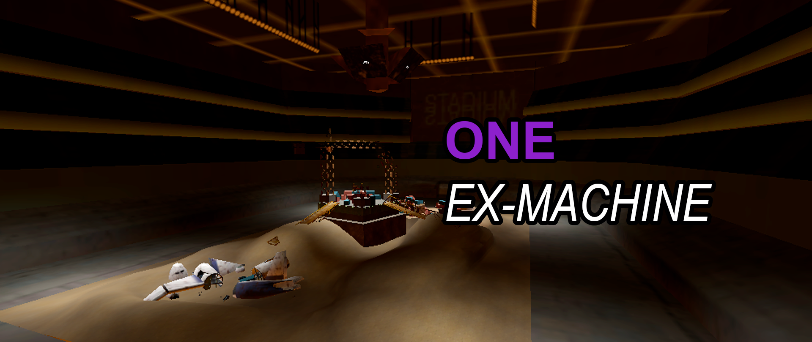  

## Disclaimer
This is a prototype made for PirateJam 2025 Summer. Bugs and unexpected behavior are expected.

## Screenshots

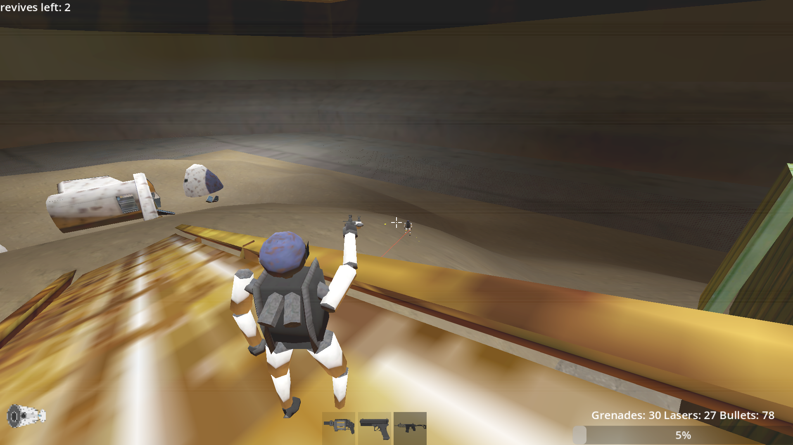

<h1 align="center">Contents</h1>  

[Gameplay Overview](#gameplay-overview)

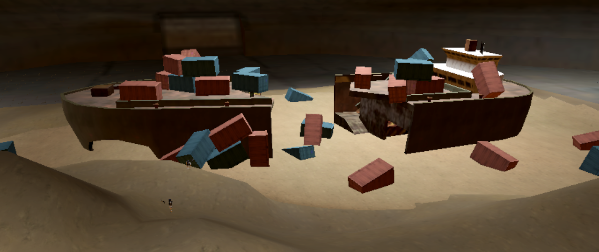

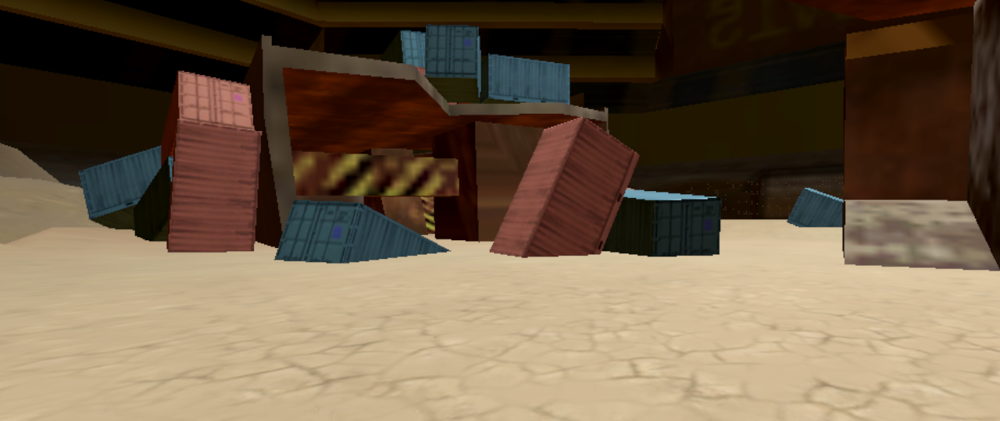

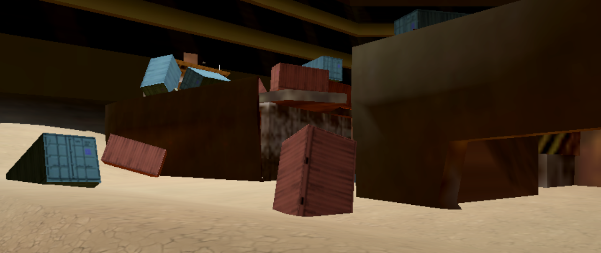

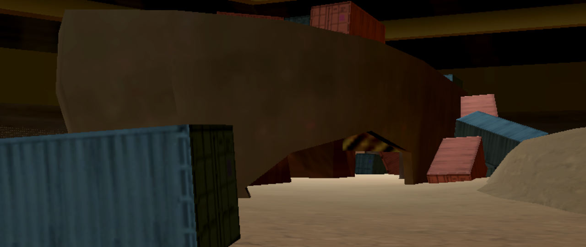

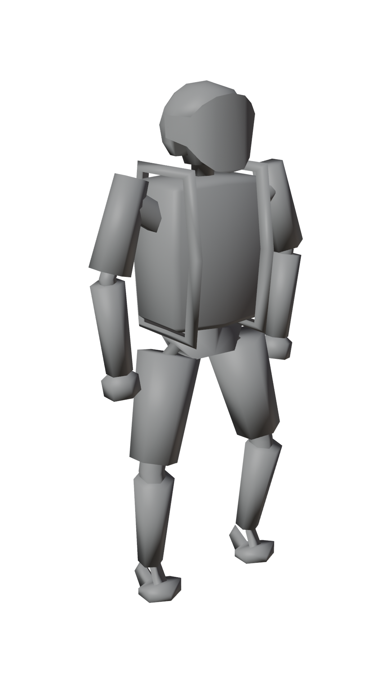

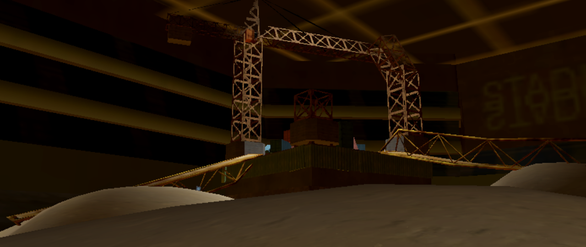

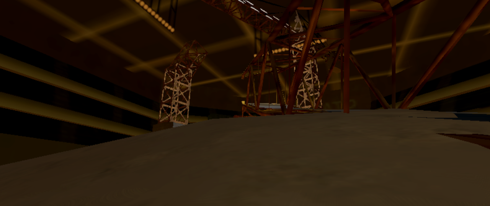

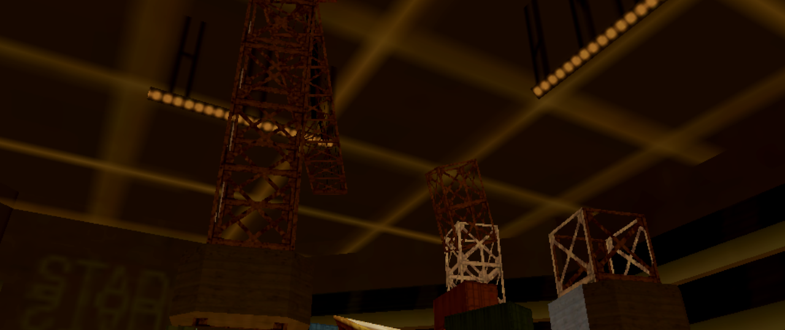

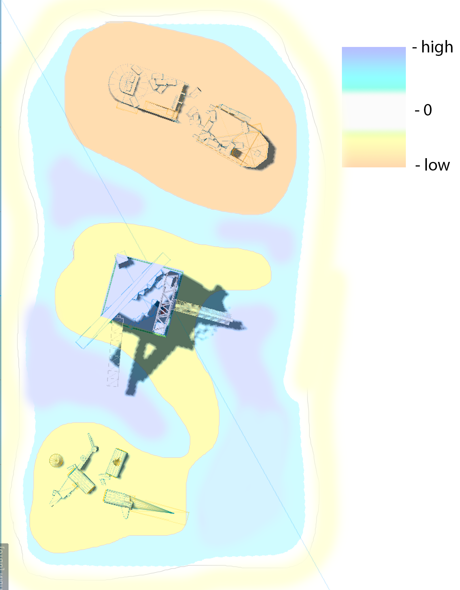

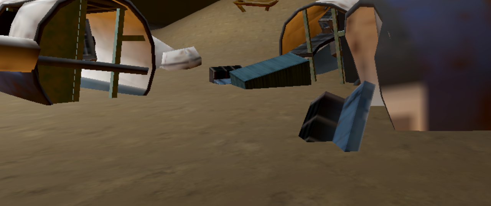

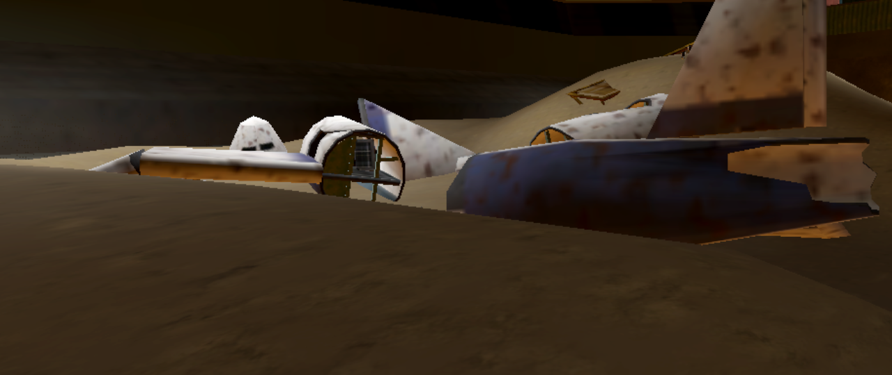

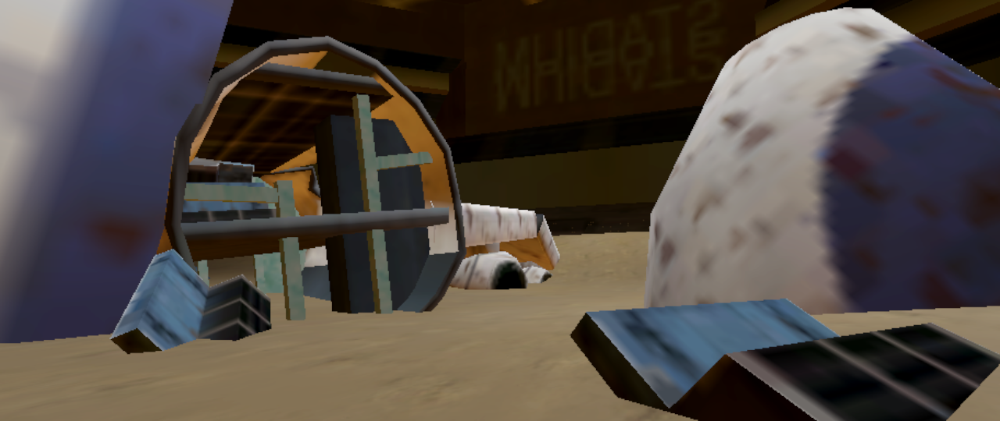

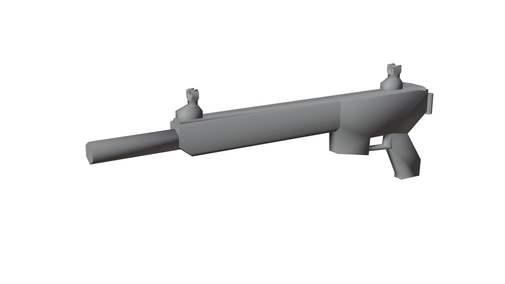

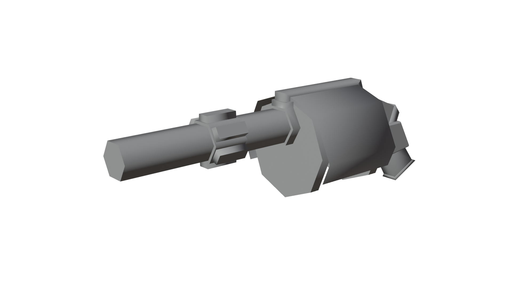

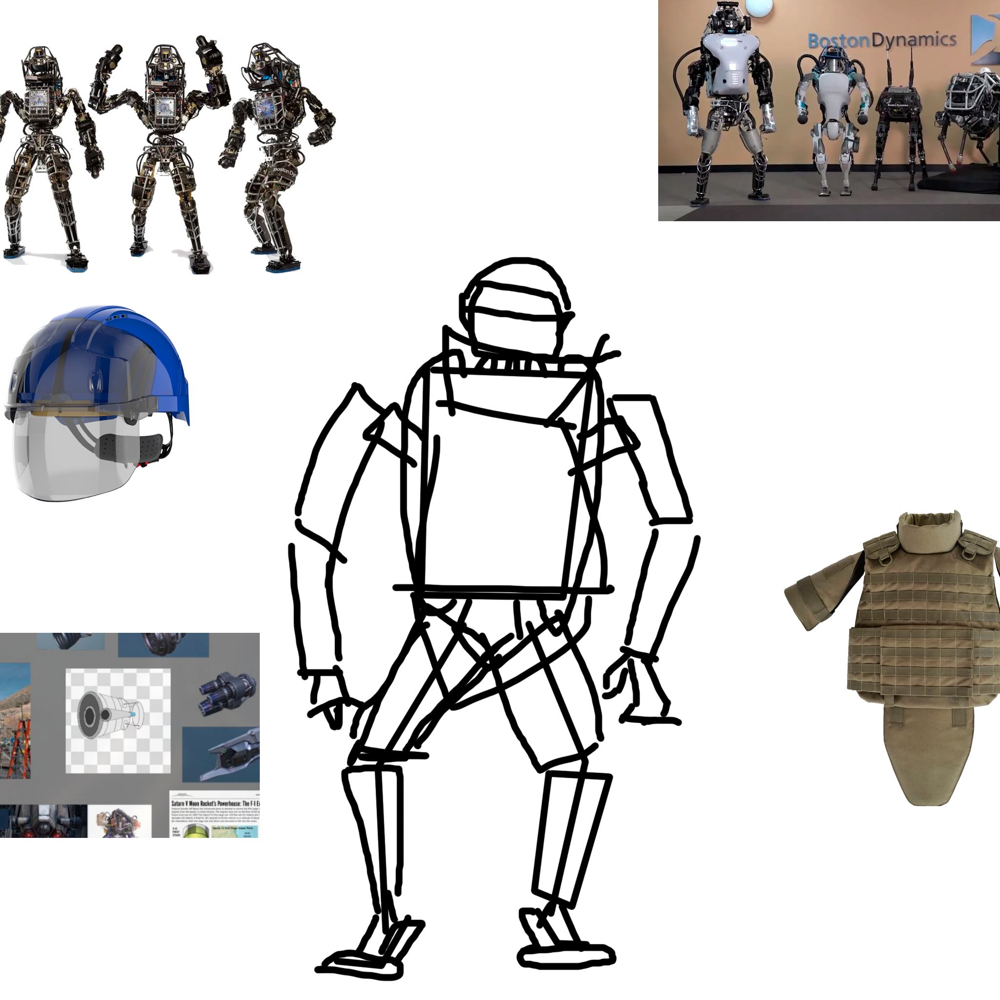

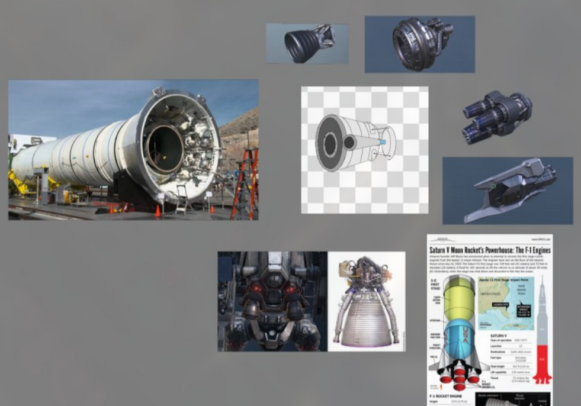

## Gameplay overview
The Ex-Machina is an 3d third person action shooter, where player supposed to controll the only one left machine: fight, die, reborn - make your way through that junk-metal pile. And remember, crowd is looking at you - do your best.
Player placed in big arena, with unique locations.

## How to build project

Requirements:
    
    OS: Windows, Linux or WEB
    Godot 4.4.1
    OpenGl 3.3+ or WebGL 2.0+ compatible GPU

1. Open project.godot file using godot editor
2. Run project
