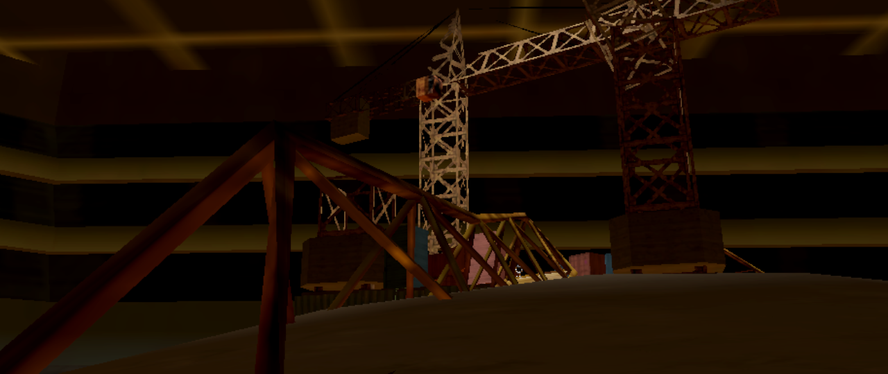

<h1 align="center">The Ex-Machina</h1>  

<crop>

</crop>

  

The Ex-Machina is an action game, where you play as an entity, who controls robots, by controlling robots a player supposed to destroy other robots in an area by taking control over them until only one is left.

## Disclaimer
This is a prototype made for PirateJam 2025 Summer. Bugs and unexpected behavior are expected.

## Screenshots

## How to build project

Requirements:
    
    OS: Windows, Linux or WEB
    Godot 4.4.1
    OpenGl 3.3+ or WebGL 2.0+ compatible GPU

1. Open project.godot file using godot editor
2. Run project
gdd ref:
https://static.wikia.nocookie.net/stalker_ru_gamepedia/images/f/f3/S.T.A.L.K.E.R._Design_Document_v1.4_.PDF/revision/latest?cb=20210427144927
https://www.manualspdf.ru/sony/god-of-war-chains-of-olympus-psp/%D0%B8%D0%BD%D1%81%D1%82%D1%80%D1%83%D0%BA%D1%86%D0%B8%D1%8F?p=5
https://mega.nz/file/JfQRxIxC#zZooR1tNIf1Ke9q1Ad7BOrUUfupsq0LfU-ZZcoyAH7E
